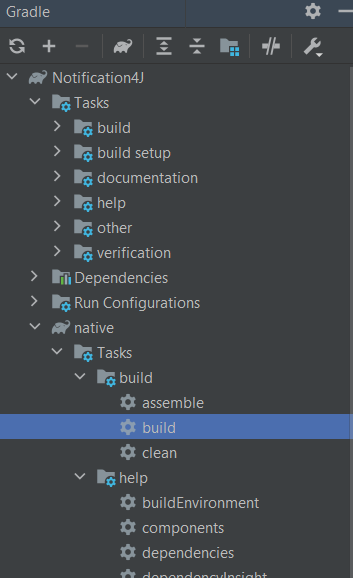
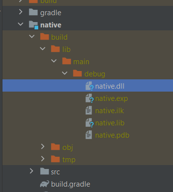

# Editing Native DLL File

**This section is intended for users who wish to add or modify functionality in the existing native code of Notification4J and compile it. If you simply want to use Notification4J as-is, without making any changes to the native code, you can skip this section.**

## Table of Contents
- [Prerequisites](#prerequisites)
- [Modifying the Native DLL](#modifying-the-native-dll)
- [Building the Project](#building-the-project)

## Prerequisites

Before you can compile the native module, make sure you have the following prerequisites in place:

- Visual Studio: Install Visual Studio, which provides the necessary toolchain for linking the native code. You can download Visual Studio from [here](https://visualstudio.microsoft.com/)
- C++ Compiler: Ensure that the C++ compiler is installed and correctly set in the environment variables of your system. You can check if the C++ compiler is properly set by opening a command prompt and running the following command: `g++ --version` 

## Modifying the Native DLL

Before editing the native file, ensure that you have the necessary Windows Kits files available for Java.

- Open the Windows Kits installation directory on your machine. Typically, it can be found at `C:\Program Files (x86)\Windows Kits\10\Include\<latest-version>\winrt`. 
- Copy all the .h (header) files from the winrt folder.
- Navigate to the `<YOUR_JDK_PATH>\include` directory, where `<YOUR_JDK_PATH>` refers to the path where your JDK is installed.
- Paste the contents of the winrt folder into the `<YOUR_JDK_PATH>\include` directory. 

## Building the Project

Follow these steps to build the project and incorporate the native DLL file:

- The native module uses Java Native Interface (JNI) to communicate with Java. You can find detailed information on how to work with C++ code in Java in this [guide](https://www3.ntu.edu.sg/home/ehchua/programming/java/javanativeinterface.html). This guide provides insights into the integration of C++ code into Java using JNI.
- To build the project, navigate to the gradle tasks of the native module. Under the "build" section, start the build process. This will compile the C++ code and generate the native DLL file.
    
    
    
- After a successful build, locate the generated native.dll file. You can find it at `native\build\lib\main\debug\native.dll`.
- Copy the `native.dll` file and paste it inside the main `project\resource` folder. This step ensures that the native DLL file is accessible within the project's resource directory.
    
    
    
